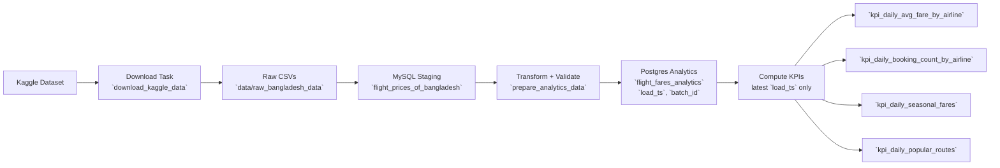

# Airflow Flight Price Analysis - Project Overview

## Summary
An Airflow-orchestrated batch pipeline that downloads a Kaggle flight price dataset, stages it in MySQL, transforms it into a Postgres analytics table, and computes KPIs only from the latest load batch.

## Architecture At A Glance
- Orchestration: Airflow DAG `flight_price_analysis` in `dags/flight_price_pipeline_dag.py`.
- Source: Kaggle dataset `mahatiratusher/flight-price-dataset-of-bangladesh` via `kagglehub`.
- Raw storage: `data/raw_bangladesh_data` (mounted to `/opt/airflow/data/raw_bangladesh_data`).
- Staging: MySQL table `flight_prices_of_bangladesh`.
- Analytics: Postgres table `flight_fares_analytics` with derived fields `flight_date`, `season`, `total_fare`, plus `load_ts` and `batch_id`.
- KPI outputs: `kpi_daily_avg_fare_by_airline`, `kpi_daily_booking_count_by_airline`, `kpi_daily_seasonal_fares`, `kpi_daily_popular_routes`.
- KPI scope: KPIs are computed only for the latest `load_ts` batch.

## Pipeline Flow (Mermaid)

## KPI Definitions
- Average Fare by Airline: daily `avg(total_fare)` per airline.
- Seasonal Fare Variation: daily `avg(total_fare)` split by `season` (peak vs non-peak).
- Booking Count by Airline: daily `count(*)` per airline.
- Most Popular Routes: daily `count(*)` by source and destination.

## Validation And Schema Controls
- CSV schema snapshot and drift detection in `src/validation/csv_schema_validation.py`.
- MySQL schema overwrite if CSV schema changes in `src/validation/csv_to_mysql_schema_overwrite.py`.
- Postgres table creation and column sync in `src/loading_postgres/setup_pg.py`.
- Analytics data validation in `src/validation/mysql_to_pg_validation.py`.

## Operational Notes
- DAG schedule: `@daily`, `catchup=False`, `start_date` 2026-02-02.
- KPI task uses `run_latest_load_kpis` to compute KPIs for the newest load batch.
- Postgres load behavior controlled by `POSTGRES_LOAD_MODE` and `POSTGRES_APPEND_STRATEGY`.
- Centralized logging via `src/utils/logging.py`.
